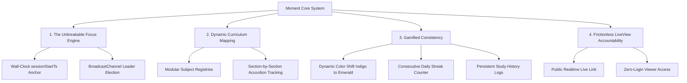
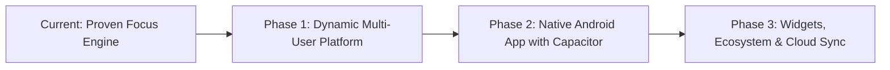

# ⚡ Moment — The Unbreakable Deep-Work Operating System

> *"Transforming the solitary grind of high-stakes preparation into a seamless, shared journey."*

---

## 1. Executive Summary

**Moment** is a highly resilient, cross-platform productivity and study engine engineered specifically for deep work, rigorous academic preparation, and high-intensity learning. Built on top of a wall-clock anchored, cross-tab synchronized engine, Moment provides an unbreakable focus environment that remains impervious to browser throttling, sleep states, and accidental tab closures. 

Moment transforms overwhelming macro-curriculums into manageable, gamified daily milestones while introducing frictionless, real-time accountability through zero-login public live sharing.

---

## 2. The Vision

Intense study regimens and high-stakes exam preparation (GATE, competitive exams, engineering masteries) shouldn't be derailed by:
- Background browser throttles losing precious tracked study time.
- State desynchronization across multiple open tabs and devices.
- Isolation and lack of accountability during grueling study marathons.

By marrying **bulletproof time-tracking mathematics** with **instant, zero-barrier community accountability**, Moment aims to become the definitive operating system for deep, continuous, and disciplined learning.

---

## 3. The Goal

To transition seamlessly from a robust, single-user web utility into a **scalable, multi-user ecosystem and fully native Android application**—without compromising a single line of the rock-solid core focus engine.

Moment empowers high-stakes exam aspirants, students, and deep-work professionals to:
1. **Track Every Second of Effort**: With absolute precision, whether on desktop, tablet, or locked phone.
2. **Celebrate Daily Consistency**: Gamified streak counters and dynamic visual feedback loops.
3. **Connect with Study Buddies Instantly**: Share a live, real-time window into their study sessions with zero login friction for accountability partners.

---

## 4. Core Pillars & Architecture

### ⏱️ Pillar 1: The Unbreakable Focus Engine
* **Wall-Clock Anchoring**: The timer calculates true elapsed duration against a fixed wall-clock timestamp (`sessionStartTs`). It is immune to background tab throttling, OS power management, or accidental browser refreshes.
* **Multi-Tab Leader Election**: Uses the browser's `BroadcastChannel` API. Exactly one active tab runs the interval loop as the "Timer Owner," while all other open tabs seamlessly synchronize in real-time without duplicate ticks or database thrashing.

### 📚 Pillar 2: Dynamic Curriculum Mapping
* **Modular Syllabus Registry**: Easily define and manage extensive multi-subject courses (e.g., *Algorithms*, *Theory of Computation*, *Engineering Mathematics*).
* **Granular Milestone Tracking**: Collapsible accordions track individual lectures, durations, and completion dates, instantly computing overall curriculum progress.

### 🔥 Pillar 3: Gamified Consistency
* **Dynamic Target Shift**: Daily content targets adaptively shift visual themes as you study:
  $$\text{Indigo (In Progress)} \longrightarrow \text{Amber (Closing In)} \longrightarrow \text{Emerald (Goal Achieved)}$$
* **Habit & Streak Analytics**: Persistent historical timelines log daily focus minutes, content hours consumed, and lecture completions to cultivate an unbroken habit loop.

### 🔗 Pillar 4: Frictionless Accountability (LiveView)
* **Zero-Login Study Buddy Link**: Users generate a unique, secure link (e.g., `moment.app/live?u=username`).
* **Instant Accountability**: Study buddies, mentors, or peer groups can open the link in any browser on any device to view live ticking timers, current subjects, and daily progress—**with no signup, no login, and no permissions required**.

---

## 5. The Commercial & Architectural Roadmap

### 🚀 Phase 1: Multi-User Platform & Dynamic Live Links
* **Authentication**: Firebase Authentication supporting Google One-Tap, Email/Password, and Guest Mode.
* **Dynamic User Partitioning**: Shift from static paths to isolated `users/{uid}` partitions.
* **Friendly Public Handles**: `usernames/{username} -> {uid}` resolution for shareable links like `/live?u=rahul`.
* **Zero-Interruption Guarantee**: Existing user accounts and legacy records remain 100% preserved and backward-compatible.

### 📱 Phase 2: Native Android Experience (Capacitor)
* **Android Foreground Service**: Persistent, non-dismissible notification bar timer (`⏱️ 03:15:22 — Algorithms [Pause] [Done]`) that Android's aggressive battery optimizations will never kill.
* **Lock Screen Action Hub**: Pause, resume, or check off lectures directly from the lock screen.
* **Home Screen App Widgets**: Live streak counters, current subject status, and instant timer triggers on Android Home Screens.
* **Haptic Feedback**: Tactile vibrations upon timer milestones and lecture completions.

---

## 🔒 Invariant Guarantee
> **All updates are additive**. The core mathematical formulas, multi-tab coordination algorithms, and local/cloud persistence mechanisms remain strictly preserved throughout all roadmap phases.
