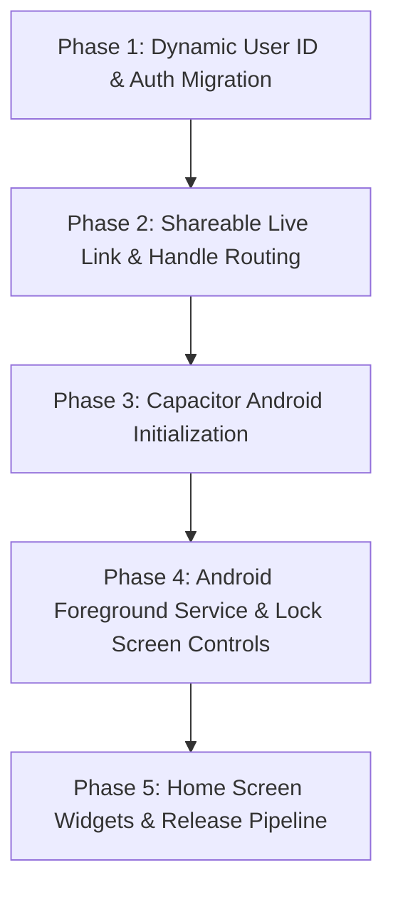

# 🧠 Moment — Technical Architecture & Implementation Roadmap

> **Scope**: Detailed technical blueprint for transforming **Moment** from a single-user focus engine into a scalable, multi-user web ecosystem and native Android application.  
> **Core Invariant**: Zero disruption to the active focus engine. All timer math (`sessionStartTs`), multi-tab leader election (`BroadcastChannel`), lockstep synchronization, and extrapolation algorithms remain 100% intact.

---

## 🏗️ Architecture Overview

```
                          ┌──────────────────────────┐
                          │       MOMENT CLIENT      │
                          │   (Web & Capacitor App)  │
                          └─────────────┬────────────┘
                                        │
                 ┌──────────────────────┴──────────────────────┐
                 ▼                                             ▼
     ┌───────────────────────┐                     ┌───────────────────────┐
     │   Authenticated User  │                     │   Study Buddy Viewer  │
     │      (Main App)       │                     │    (Zero-Login Live)  │
     └───────────┬───────────┘                     └───────────┬───────────┘
                 │                                             │
                 │ Read / Write                                │ Read Only
                 ▼                                             ▼
     ┌─────────────────────────────────────────────────────────────────────┐
     │                     Firebase Realtime Database                      │
     │                                                                     │
     │   users/{uid}/global/ (timer, dailyStudy, subjectDailyStudy)        │
     │   users/{uid}/subjects/ (completed, lectureDates)                   │
     │   users/{uid}/liveStats/ (public read for study buddies)           │
     │   usernames/{handle} -> uid                                         │
     └─────────────────────────────────────────────────────────────────────┘
```

---

# 🚀 Part 1: Dynamic Multi-User & Shareable Study Buddy System

### 1. Zero-Disruption Dynamic Engine Context
Currently, the database references are scoped to `users/rahul/...`. To support any number of users:
- The core engine functions will receive `userId` via a lightweight React Context / parameter.
- Default fallback ensures offline and guest sessions continue functioning seamlessly without network lag.

```
Firebase Realtime Database Hierarchy:
users/
  ├── {userId_A}/                    <-- Protected (Owner Read/Write)
  │     ├── global/
  │     │     ├── timer              <-- { sessionElapsed, sessionStartTs, lastSavedTs, running }
  │     │     ├── dailyStudy         <-- { "2026-08-18": 14400, ... }
  │     │     ├── subjectDailyStudy  <-- { "2026-08-18": { "algorithms": 7200, ... } }
  │     │     └── settings/          <-- { activeSubject, focusGoalMins, subjects }
  │     ├── subjects/
  │     │     └── {subjectId}/       <-- { completed: [1, 2, ...], lectureDates: { "1": "2026-08-18" } }
  │     └── liveStats/               <-- Public Read, Owner Write (for Live View)
  │           ├── activeSubject
  │           ├── running
  │           ├── timerStartTs
  │           ├── todayFocusSecs
  │           ├── todayCourseMins
  │           ├── streak
  │           └── updatedAt
  │
  └── {userId_B}/
        └── ...
```

---

### 2. Authentication & Backward Compatibility
- **Auth Provider**: Firebase Authentication (Google One-Tap Sign-In, Email/Password, and Guest/Local Mode).
- **Zero Data Loss Guarantee**: Legacy account data (e.g. `users/rahul`) will automatically migrate/link to the user's authenticated Google account on first sign-in.
- **User Handles / Slugs**:
  - Each user chooses a unique username / handle (e.g., `rahul`, `alex`, `sarah`).
  - Mapping registry: `usernames/{username} -> {uid}` allows human-friendly shareable URLs:
    $$\text{https://moment.app/live?u=rahul} \quad \text{instead of} \quad \text{https://moment.app/live?u=a8X9fK2001l...}$$

---

### 3. Shareable "Study Buddy" Live Link Flow
1. **User Side**:
   - In the header, a prominent **"🔗 Share Live Progress"** button.
   - Clicking copies `https://moment.app/live?u=<username>` to clipboard with an instant confirmation toast.
2. **Study Buddy Side**:
   - Opens the link in any mobile/desktop browser.
   - **Zero login, zero signup, zero friction**.
   - Displays real-time ticking focus timer, active course module, daily focus completion ring, and lecture checklist.

---

### 4. Firebase Security & Privacy Rules
```json
{
  "rules": {
    "users": {
      "$uid": {
        ".read": "auth != null && auth.uid == $uid",
        ".write": "auth != null && auth.uid == $uid",
        "liveStats": {
          ".read": true,
          ".write": "auth != null && auth.uid == $uid"
        }
      }
    },
    "usernames": {
      ".read": true,
      "$username": {
        ".write": "auth != null && (!data.exists() || data.val() == auth.uid)"
      }
    }
  }
}
```

---

# 📱 Part 2: Native Android Application (Capacitor)

### 1. Why Capacitor Native Container?
- **100% Code Reuse**: The battle-tested React engine runs inside a high-performance native WebView.
- **Native OS Bridge**: Full access to native Android APIs (Foreground Services, Notifications, Storage, Haptics).
- **Fast Time to Market**: No duplicate maintenance or porting required.

```
┌────────────────────────────────────────────────────────┐
│                   Moment Android App                   │
├────────────────────────────────────────────────────────┤
│  Native Android Shell (Capacitor Runtime)              │
│  ├── Android Foreground Service (Persistent Timer)     │
│  ├── Lock Screen Notification & Media Controls         │
│  ├── Jetpack Glance Home Screen Widgets                │
│  └── Native Haptic Feedback & Power WakeLocks          │
├────────────────────────────────────────────────────────┤
│  High-Performance WebView                              │
│  └── Moment React 19 UI & Core Engine                  │
└────────────────────────────────────────────────────────┘
```

---

### 2. Android Capabilities Breakdown

#### A. Android Foreground Service & Persistent Status Bar Timer
- Android aggressively terminates background tasks unless anchored to a **Foreground Service**.
- Moment runs an ongoing notification:
  $$\text{⏱️ 02:45:10 — Algorithms} \quad [\text{Pause}] \quad [\text{Done}]$$
- **Guarantee**: Even if the screen is locked for 8 hours or battery saver is active, the timer continues with mathematical precision.

#### B. Lock Screen Interactive Controls
- Media/Notification style action buttons allow users to pause, resume, or finish sessions directly on the lock screen without unlocking their phone.

#### C. Home Screen Glance Widgets
- Compact Android widget showing:
  - Today's Total Focus Time
  - Active Subject & Current Lecture
  - Daily Goal Progress Ring
  - One-tap "Start / Resume" button

#### D. Native Haptics & Desk Focus Mode
- Tactile feedback upon timer start, pause, reset, and lecture completion.
- Optional "Keep Screen Awake" desk study mode.

---

# 🗺️ Phased Implementation Plan



### Phase 1: Dynamic User Partitioning
* Refactor database references from static paths to dynamic `users/${userId}` contexts.
* Implement seamless local guest mode fallback.

### Phase 2: Firebase Auth & Public Live View Routing
* Add Firebase Authentication modal (Google Sign-In + Email).
* Add handle reservation (`usernames/{handle}`).
* Update `LiveView.jsx` to resolve `?u=username` $\rightarrow$ `uid` dynamically.
* Add header "Share Live Progress" button with clipboard toast.

### Phase 3: Android App Initialization (Capacitor)
* Add `@capacitor/core`, `@capacitor/android`, and `@capacitor/cli`.
* Generate Android Studio project (`/android`).
* Configure package ID (`com.moment.tracker`), icons, splash screen, and permissions.

### Phase 4: Foreground Service & Lock Screen Notification
* Implement native Android Foreground Service for timer persistence.
* Bind notification actions (`Play`, `Pause`, `Complete`) to the webview state.

### Phase 5: App Distribution & Widgets
* Implement Android Home Screen App Widget using Jetpack Glance.
* Set up automated GitHub Actions workflow to build release APKs and App Bundles (`.aab`).
