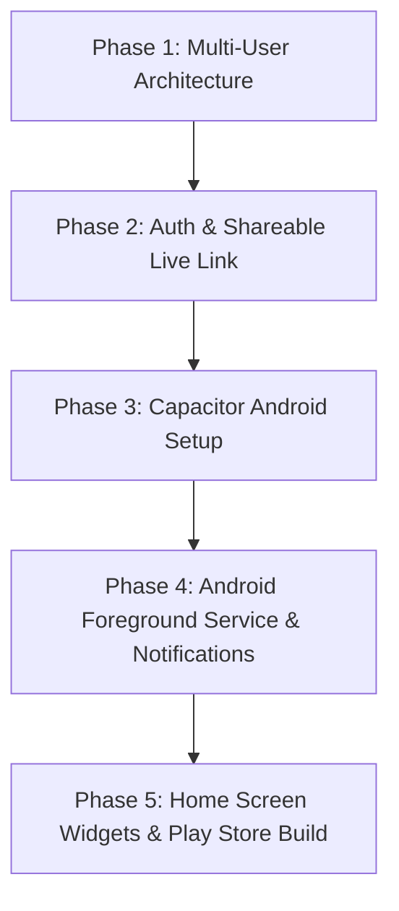

# 🧠 Brainstorming: Dynamic Multi-User Platform & Native Android App

> **Scope**: High-level architecture, roadmap, and design specifications.  
> **Rule**: No modifications to the active production codebase. All existing timer logic, sync guarantees, and mathematical reliability remain 100% intact.

---

## 🎯 Vision Overview

1. **Dynamic Multi-User & Shareable Study Buddy Links (Web)**
   - Move from single-user (`users/rahul`) to dynamic authenticated users (`users/{uid}`).
   - Anyone can sign up/login, track their own subjects, timers, and goals.
   - **One-Click Shareable Live View**: Every user gets a dedicated public link (e.g. `tracker.app/live?u=rahul` or `tracker.app/live/rahul`).
   - Anyone with the link can view real-time study progress with **zero login required**.

2. **Native Android Application**
   - Transform the tracker into a true Android app (`.apk` / Play Store).
   - Add native OS capabilities: Foreground Service (persistent notification timer), Screen-off background stability, and Home Screen Widgets.

---

# 🚀 Part 1: Dynamic Multi-User & Study Buddy System

### 1. The Core Principle: Preserving the Existing Engine
The timer engine, lockstep attribution, multi-tab election, and LiveView extrapolation are rock solid.  
To support multiple users without touching the engine's core math:
- All database paths change from hardcoded `users/rahul/...` to `users/${currentUserId}/...`.
- The engine functions take `userId` as context.

```
Firebase Database Hierarchy:
users/
  ├── {userId_A}/                    <-- Protected (Owner Read/Write)
  │     ├── global/
  │     │     ├── timer
  │     │     ├── dailyStudy
  │     │     ├── subjectDailyStudy
  │     │     └── settings/ (activeSubject, focusGoalMins, subjects)
  │     ├── subjects/ (completed, lectureDates)
  │     └── liveStats/               <-- Public Read, Owner Write (for Live View)
  └── {userId_B}/
        └── ...
```

---

### 2. Authentication & Backward Compatibility
- **Auth Provider**: Firebase Authentication (Google One-Tap Sign-In + Email/Password + Anonymous Guest Mode).
- **Legacy Account Preservation**: Your current account (`rahul`) will be linked directly to your Google account on first login, ensuring **zero data loss**.
- **User Handles / Slugs**:
  - Each user chooses a unique username / handle (e.g. `rahul`, `alex`, `sarah`).
  - Mapping table: `usernames/{username} -> {uid}` allows friendly URLs like `/live?u=rahul` instead of ugly random UID strings.

---

### 3. Shareable "Study Buddy" Live Link
- **Main App UI**: Add a **"🔗 Share Live Progress"** button in the header.
- **Click Action**: Copies `https://tracker.domain/live?u=rahul` to clipboard with a visual toast notification ("Live link copied!").
- **Recipient Experience**:
  - Study buddy clicks the link.
  - Opens `LiveView` immediately.
  - **No login, no signup, no permissions prompt**.
  - Displays the friend's current subject, live ticking clock, today's focus time, completed lectures, and course progress in real-time.

---

### 4. Firebase Security Rules (Privacy & Data Protection)
```json
{
  "rules": {
    "users": {
      "$uid": {
        ".read": "auth != null && auth.uid == $uid",
        ".write": "auth != null && auth.uid == $uid",
        "liveStats": {
          ".read": true,
          ".write": "auth != null && auth.uid == $uid"
        }
      }
    },
    "usernames": {
      ".read": true,
      "$username": {
        ".write": "auth != null && (!data.exists() || data.val() == auth.uid)"
      }
    }
  }
}
```

---

# 📱 Part 2: Native Android Application

To turn this into a real Android app, there are two primary architectural pathways:

---

### Approach A: Capacitor Native Container (Recommended)
**Why this is the best path for this project:**
- **100% Code Reuse**: Runs the exact same battle-tested React codebase inside a high-performance native WebView.
- **Native Android Bridge**: Gives full access to Android Native APIs (Services, Notifications, Widgets, Storage).
- **Fastest to production**: Zero need to rewrite 2,500 lines of UI in Kotlin/Java.

#### Native Android Features Unlocked with Capacitor:
1. **Android Foreground Service & Notification Timer**:
   - Runs a persistent notification in the Android status bar (e.g. `⏱️ 02:45:10 — Engineering Mathematics [Pause] [Done]`).
   - Android OS will **never kill or throttle the timer in the background**, even when battery saver is on or when the screen is locked for 6 hours.
2. **Lock Screen Controls**:
   - Pause / Resume timer directly from the lock screen without unlocking the phone.
3. **Home Screen Glance Widget**:
   - An Android App Widget showing:
     - Today's Total Focus Time
     - Currently Active Subject
     - Quick "Start/Pause" button right on the phone's home screen.
4. **Haptic Feedback**:
   - Subtle native vibrations on timer start, pause, reset, and lecture completion.
5. **Offline SQLite / Local Cache**:
   - Full offline functionality when studying in libraries with poor cellular connectivity.

---

### Approach B: Pure Native Android App (Kotlin + Jetpack Compose)
- **Tech Stack**: Kotlin, Jetpack Compose, Android Room DB, Firebase Android SDK, WorkManager.
- **Pros**: 100% native UI performance, deep Material 3 / Dynamic Theming integration.
- **Cons**: Requires building the entire UI, state machine, and charts from scratch in Kotlin.

---

# 🗺️ Implementation Roadmap (Phased Execution)



### Phase 1: Dynamic User ID Parameterization
- Replace hardcoded `rahul` with dynamic `userId` context.
- Keep default fallback so development and offline modes continue working seamlessly.

### Phase 2: Firebase Auth & Public Live View Routing
- Add Login Modal (Google Auth + Email).
- Add username reservation (`usernames/{handle}`).
- Update `LiveView.jsx` to parse `?u=handle` or `?u=uid` from the URL query.
- Add "Copy Share Link" button with toast notification.

### Phase 3: Android App Initialization (Capacitor)
- Add `@capacitor/core`, `@capacitor/android`, and `@capacitor/cli`.
- Generate native Android Studio project (`android/` folder).
- Configure Android package ID (e.g. `com.gate.coursetracker`), app icons, splash screen, and permissions.

### Phase 4: Native Android Capabilities
- Implement Android Foreground Service for the persistent notification timer.
- Add notification action buttons (Play / Pause / Next Lecture).
- Add Keep-Screen-On toggle for desk study mode.

### Phase 5: App Store Release / APK Distribution
- Generate signed release APK and Android App Bundle (`.aab`).
- Set up automatic GitHub Actions build pipeline to compile new APKs on git push.

---

## 💬 Discussion & Next Steps
- When ready to proceed with Phase 1 & 2 (Multi-User & Share Link), we can design the auth UI and test it without disturbing existing data.
- When ready for Phase 3 (Android App), we can initialize the Android project and generate your first test `.apk` to install on your phone.
